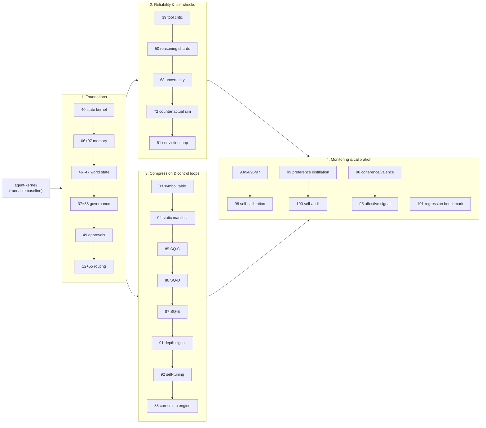

# Engineering Research: Agent & Self-Custody Systems

A collection of engineering patterns worked out while building a self-custodial, agent-driven identity and wallet system. Each one is written up as a standalone research guide — the problem it solves, the design decisions behind it, the algorithm, and a small reference implementation you can actually run.

This is shared in the spirit of *here is how I approached these problems, in case it's useful to you* — not as a framework, a product, or a claim to have solved anything for good. Take what helps, ignore the rest, improve on it.

## What this is — and isn't

- **It is** 99 self-contained, runnable reference implementations with the reasoning attached (numbered 1–101; 73 and 89 are reserved/retired and intentionally absent — see the catalog below for the live list). Most code you find online shows you *what*; these try to show you *how* it actually works, not just the rationale for building it.
- **It is not** an audited, production-ready library. Each implementation isolates a single idea so it can be read and run in a few minutes. Several deliberately reimplement an idea on Node.js built-ins just to stay runnable; each guide notes where a real system would reach for a vetted dependency instead.
- **The cryptography here is educational.** Where a guide hand-rolls a primitive it says so, and points to what production should use (`@noble/*`, `ethers`, audited libraries). Read those as *the shape of the technique*, not *ship this as-is*.

## Essential patterns

Short on time? These are the highest-leverage guides — most other guides in the catalog either depend on one of these or extend it:

| # | Guide | Why start here |
|---|-------|-----------------|
| — | [`agent-kernel/`](./agent-kernel/) | The five primitives (memory, tool routing, governance, wallet limits, world model) in one runnable, dependency-free file. Fastest way to see the whole shape of an agent runtime. |
| 40 | [Conversation State Kernel](./40-conversation-state-kernel/) | The turn-level state machine everything else in "Foundations" assumes is already in place. |
| 12 | [Resilient Multi-Provider LLM Routing](./12-resilient-llm-routing/) | Per-backend health probes and cascade routing — the pattern most production agent systems reinvent badly. |
| 07 | [Reflective Memory](./07-reflective-memory/) | Categorized, use-reinforced memory with stale pruning — the baseline every memory guide below it builds on. |
| 37 | [Tiered Authority Bands](./37-agent-authority-bands/) | The permission model that makes autonomous write actions safe to reason about. |
| 03 | [Adaptive Session Symbol Table](./03-adaptive-session-compression/) | The entry point into the whole compression chain (03 → 04 → 85 → 86 → 87 → 91 → 92 → 88). |
| 68 | [Calibrated Uncertainty Engine](./68-calibrated-uncertainty-engine/) | Turns raw confidence into an act/escalate/abstain decision — the reliability pattern most agents skip. |
| 100 | [Automatic Post-Turn Self-Audit](./100-post-turn-self-audit/) | A concrete, small example of an agent correcting its own style/behavior from its own output. |

## Who it's for

Builders working on AI agent runtimes, self-custody / wallet tooling, or local-first systems who hit one of these walls and want a worked example with the trade-offs spelled out. If you use an AI coding agent, you can point it at this repo and ask it to explain, critique, or adapt any guide — every folder is self-contained and small enough to reason about in a single pass.

Every guide follows the same structure:

- **Problem** — the concrete failure mode or constraint that motivates the pattern.
- **Design decisions** — the load-bearing choices and the trade-offs behind them.
- **Algorithm** — pseudocode for the core mechanic.
- **Reference implementation** — a standalone `.ts` file in the same folder, runnable with `node <file>.ts --demo` (Node.js built-ins preferred; external dependencies are called out explicitly).
- **Usage** — how to wire the pattern into your own code.
- **Limitations and extensions** — where it stops, and how to push it further.

The reference implementations are educational: read them, run them, adapt them. They are not drop-in production libraries, and anything that would touch real keys or broadcast a real transaction is gated behind a safe `--demo` path that does neither.

## Running the demos

Most guides depend only on Node.js built-ins and run directly under Node 24+ (which strips TypeScript types natively) or `tsx`:

```bash
# Node 24+ runs the built-in-only demos directly:
node 01-fh-kdf/fh-kdf.ts --demo

# Or with tsx:
npx tsx 03-adaptive-session-compression/sq-symbol-table.ts --demo
```

A handful of guides require external libraries and will only run once those are installed in the directory (`npm i <package>`):

| Guide | Required package(s) |
|-------|---------------------|
| 05 — Encrypted Identity Blobs | `@msgpack/msgpack` |
| 13 — Committed Lattice Secret Sharing | `secrets.js-grempe` |
| 15 — Multi-Chain Shadow Derivation | `@noble/curves`, `tweetnacl`, `bs58` |
| 19 — Hybrid Post-Quantum Identity | `@noble/post-quantum` |
| 20 — SIWE + Passkey Floor | `ethers` |

Each guide's "Reference implementation" section lists exactly what it needs. Where a guide could pull in a heavy chain SDK (e.g. guide 34's per-chain transaction builders), the SDK is kept behind a pluggable adapter so the file still runs on built-ins alone — the demo simply skips the chains you have not wired an adapter for.

## A minimal runtime: `agent-kernel`

Where the guides go deep on one idea each, [`agent-kernel/`](./agent-kernel/) pulls the
core into a single tiny, dependency-free runtime — the five primitives every
capable agent needs: **memory**, **tool routing**, **governance**, **wallet
limits**, and a **world model**. It is not a framework and not a product; it
ships the *mechanism* and leaves the *policy* (your limits, capabilities, chains,
prompts) to you. Run `node agent-kernel/demo.ts` to see one agent turn at a time
exercise all five. The guides below are the ways to push each primitive further.

## Start here

99 guides is too many to read cold. If you want to build toward guide 100/101's level of sophistication from scratch, this is the dependency-respecting order — each phase assumes the previous one is in place:



1. **Foundations** — [40](./40-conversation-state-kernel/) (turn-level state machine) → [06](./06-compound-memory-salience/) + [07](./07-reflective-memory/) (memory) → [46](./46-typed-world-model-graph/) + [47](./47-ambient-snapshot-bus/) (world state) → [37](./37-agent-authority-bands/) + [38](./38-will-constitution-engine/) (governance primitives) → [49](./49-batched-approval-ceremony/) (approvals) → [12](./12-resilient-llm-routing/) + [55](./55-tool-dependency-dag/) (routing and tool dispatch).
2. **Reliability and self-checks** — [39](./39-tool-critic/) (tool critic) → [50](./50-headless-reasoning-shards/) (disposable reasoning shards) → [68](./68-calibrated-uncertainty-engine/) (calibrated confidence) → [72](./72-counterfactual-simulation/) (dry-run before acting) → [81](./81-conviction-policy-enforcement/) (conviction → policy enforcement loop, unifies 37/38 + dissent).
3. **Compression and control loops** — [03](./03-adaptive-session-compression/) → [04](./04-session-static-manifest/) → [85](./85-sqc-linguistic-multiplex/) → [86](./86-sqd-sentence-template/) → [87](./87-sqe-dialogue-arc/) → [91](./91-continuous-compression-depth/) → [92](./92-self-tuning-compression-threshold/) → [88](./88-cognitive-curriculum-engine/). Each step compounds on the one before it; 88 is the payoff and needs the whole chain.
4. **Monitoring and calibration** — [93](./93-free-energy-control-signal/), [94](./94-interstitial-loss-accounting/), [96](./96-proactive-capacity-limit-estimation/), [97](./97-blended-session-uncertainty/) (97 depends on 91) → [98](./98-outcome-grounded-self-calibration/); separately [99](./99-implicit-preference-distillation/) → [100](./100-post-turn-self-audit/); [101](./101-continuous-regression-benchmarking/) last, once you have a stable scoring baseline to regress against. [95](./95-computed-affective-state-signal/) depends on [90](./90-composite-coherence-drift-metric/).

Everything else in the catalog below is a self-contained pattern you can pull in independently once you hit the wall it solves.

## Not sure where to start? Use the 100-Seed matrix

[`seeds/`](./seeds/) turns "I want to build X" into a starting reading list. It places X on three independent axes — **Domain** (consumer app, real-time game, creative media, embodied/IoT, or an emergent multi-agent category that doesn't fully exist yet) × **Governance** (how much autonomy the agent gets) × **Latency** (how fast it has to respond) — for 5 × 5 × 4 = 100 combinations, each pre-mapped to the catalog guides most load-bearing for that combination.

```bash
node seeds/select-seed.ts --describe "a co-op dungeon crawler with an AI dungeon master"
```

See [`seeds/README.md`](./seeds/README.md) for the full axis breakdown and the generator.

## Quickstart

```bash
git clone <this-repo>
cd agent-kernel
node demo.ts
```

That's the whole runtime — memory, tool routing, governance, wallet limits, and a world model — running in under 30 seconds with no install step. From there, pick a guide from "Essential patterns" above or follow the roadmap below.

## Catalog

### Cryptography, identity, and authentication

| # | Guide | Summary |
|---|-------|---------|
| 01 | [Fibonacci-Harmonic KDF](./01-fh-kdf/) | A domain-separated key-derivation function combining HKDF with a harmonic mixing schedule. |
| 02 | [Post-Quantum HKDF](./02-pq-hkdf/) | HKDF built on SHA3-256 for a post-quantum-oriented hash core. |
| 13 | [Committed Lattice Secret Sharing](./13-fractal-lattice-sharding/) | High-dimensional lattice secret sharing with a SHA-256 commitment that detects silent shard corruption. |
| 19 | [Hybrid Post-Quantum Identity](./19-hybrid-pqc-identity/) | Zero-interaction enrollment of ML-DSA + SLH-DSA keys shadowing an ECDSA account; dual-signed receipts and hybrid JWTs. |
| 20 | [SIWE Login with a Passkey Floor](./20-siwe-passkey-floor/) | Wallet sign-in plus a context-bound WebAuthn assertion required for every state-changing operation. |
| 21 | [Behavioral Continuous Authentication](./21-behavioral-continuous-auth/) | A 9-dimension motion vector with an EMA profile and cosine-similarity step-up auth. |
| 41 | [Hybrid RSA + Post-Quantum OIDC Signing](./41-hybrid-oidc-pq-signing/) | Standard RS256 JWTs carry a detached ML-DSA-65 signature keyed from the RSA `kid` + secret, so breaking RSA alone cannot forge a token and RS256-only clients still verify. |
| 43 | [Domain-Isolated Address Aliases](./43-domain-isolated-address-alias/) | Per-domain HKDF derivation yields a distinct deterministic address for every site, making one user unlinkable across sites with no registry. |
| 51 | [Deterministic Post-Quantum Action Receipts](./51-deterministic-action-receipts/) | Canonical-JSON action hashes signed by a wallet-deterministic post-quantum key, verifiable indefinitely without any server state. |

### Wallet custody and transaction controls

| # | Guide | Summary |
|---|-------|---------|
| 15 | [Multi-Chain Shadow Wallet Derivation](./15-multichain-shadow-derivation/) | Deterministically derive BTC, EVM, Solana, and Tron addresses from one identity string + secret via HKDF — no BIP-39 seed. |
| 16 | [Time-of-Flight Proximity Payment](./16-proximity-payment-tof/) | A relay-resistant "tap to pay" using round-trip time-of-flight over Web Bluetooth / WebNFC. |
| 17 | [Agent Spend-Limit Wallet](./17-agent-spend-limit-wallet/) | An autonomous hot wallet that auto-executes under a threshold and requires a human approval above it. |
| 18 | [Multi-Chain Spend Governor](./18-multichain-spend-governor/) | Fail-closed daily spend limits normalizing every chain/token to one base currency via live pricing. |
| 29 | [Quorum Vault Groups](./29-quorum-vault-groups/) | M-of-N approval with passkey assertions, plus recursive child sub-vaults with autonomous caps that escalate to full quorum. |
| 32 | [Covenant Dual-Custody](./32-covenant-dual-custody/) | Bind a human-owned proof token to a machine-owned proof token at creation to link a human and an agent identity. |
| 34 | [Emergency Cross-Chain Sweep](./34-emergency-cross-chain-sweep/) | A panic button that derives a clean wallet and parallel-sweeps funds across every selected chain at once. |

### Memory, knowledge, and world state

| # | Guide | Summary |
|---|-------|---------|
| 06 | [Compound Memory Salience Scoring](./06-compound-memory-salience/) | Re-rank vector-search hits by a weighted blend of similarity, recency, emotion, confidence, and trust, with corrections taking hard priority. |
| 07 | [Reflective Memory](./07-reflective-memory/) | Categorized lessons with use-reinforced sorting — touching a memory warms it and floats it up — plus stale pruning. |
| 10 | [Intent-Gated Personal Knowledge Shards](./10-personal-knowledge-shards/) | A structured personal-facts layer gated by intent and provenance, where security paths only trust observed facts. |
| 33 | [Knowledge Absorber → Zero-Token Vocabulary](./33-knowledge-absorber-sq-vocab/) | Detect knowledge gaps, distill standalone facts, and graduate them into a zero-token vocabulary referenced via the session codec. |
| 46 | [Typed World-Model Graph with Goal Topology](./46-typed-world-model-graph/) | A typed per-user entity graph with parent/child goal topology that reconstructs life-goal hierarchies at read time and injects a compact world-model block. |
| 47 | [Ambient World-Snapshot Prefetch Bus](./47-ambient-snapshot-bus/) | A query planner splits broad categories into micro-queries and keeps small digests warm with confidence decay, so the agent rarely needs a live tool call. |
| 60 | [On-Demand Encrypted Knowledge Blobs](./60-on-demand-knowledge-blobs/) | Knowledge fragments stored as compressed, encrypted, content-addressed blobs, fetched and injected on intent match then evicted to avoid prompt bloat. |
| 71 | [Memory Consolidation ("Sleep")](./71-memory-consolidation-sleep/) | A maintenance pass over the agent's own memory: decay and forget stale trivia, merge near-duplicates while boosting corroborated salience, and promote facts confirmed across distinct sessions into durable pinned lessons. |
| 75 | [World-Model Belief State](./75-world-model-belief-state/) | What the agent believes is *true* while it acts: claims weighted by source trust, decayed by age, contradiction-resolved, and revised as evidence arrives. |
| 79 | [Encrypted Offline Memory Cache](./79-encrypted-offline-memory-cache/) | WebCrypto AES-GCM per-entry encryption + Bloom-filter recall index lets the agent access episodic memory when the network is unavailable, without leaking plaintext to extensions or scripts. |
| 82 | [Proactive Memory Pre-injection](./82-proactive-memory-injection/) | Surfaces episodic memories into the system prompt before the LLM speaks, eliminating the recall round-trip and closing the "cold first reply" gap for sovereign AI workloads. |

### Model routing, tool orchestration, and adaptation

| # | Guide | Summary |
|---|-------|---------|
| 09 | [Intent-Based Tool Schema Selection](./09-intent-based-tool-selection/) | A core tool set plus intent-classified drawers and a name-only index, cutting tool-schema tokens by more than half. |
| 12 | [Resilient Multi-Provider LLM Routing](./12-resilient-llm-routing/) | Named-mode fast-fail vs. auto-waterfall cascade across providers, per-backend health probes, and small-model context re-encoding. |
| 24 | [Cloud / Local Privacy Router](./24-cloud-local-privacy-router/) | Classify each turn's sensitivity and redact secrets before any cloud call, so the cloud sees intent, not secrets. |
| 30 | [Agent LoRA / Prefix-Weight Compiler](./30-lora-prefix-weight-compiler/) | Compile agent personality into an encrypted, content-addressed spec and bake stable facts into prefix-cacheable model messages. |
| 31 | [Relational Intelligence Model](./31-relational-intelligence-model/) | Longitudinal signal tracking that infers stress and trust and calibrates response density and tone. |
| 52 | [Competence-Gated On-Device Distillation Router](./52-competence-distillation-router/) | Routes a turn to a local model once an intent has accumulated enough demonstrated-competence training pairs, escalating complex turns to the cloud. |
| 53 | [Manifest-Driven LoRA Expert Router](./53-lora-manifest-router/) | A manifest of expert adapters selected by intent kind and trigger-term regex to activate task-specific local weights. |
| 55 | [Dependency-Aware Parallel Tool Dispatch](./55-tool-dependency-dag/) | Builds a topological DAG of tool calls, running independent nodes concurrently and chaining dependents on their inputs. |
| 56 | [Speculative Tool Prefetch](./56-speculative-tool-prefetch/) | A small predictor watches a stream's first tokens to pre-execute likely tools in the background, turning tool waits into cache hits. |
| 58 | [Batched Intent Collapse with Merkle Fan-Out](./58-batched-intent-collapse/) | Deduplicates shared context across many pending intents into one dense call anchored by a Merkle root, then fans results back out per virtual channel. |

### Governance, policy, and safe-action control

| # | Guide | Summary |
|---|-------|---------|
| 08 | [DB-Backed Autonomous Agent Scheduler](./08-autonomous-agent-scheduler/) | A polling scheduler that fires agent work on a clock with atomic claims, failure isolation, and timezone-aware anchors. |
| 37 | [Tiered Authority Bands](./37-agent-authority-bands/) | Permission bands (0–4) gating which tools an agent may invoke at a given authority level. |
| 38 | [Will/Objective Topology + Constitutional Guardrails](./38-will-constitution-engine/) | A goal-topology engine paired with an invariant guardrail layer that filters proposed actions against hard rules. |
| 39 | [Tool-Use Critic](./39-tool-critic/) | An independent validator that judges whether a tool call is appropriate and whether it achieved its intent, feeding correction memories. |
| 40 | [Conversation State Kernel](./40-conversation-state-kernel/) | A per-turn finite state machine governing surface locks, dispatch, fork gating, and an empty-response guard. |
| 48 | [Action Idempotency Reconciler](./48-action-idempotency-reconciler/) | Canonical recursive-sorted-args fingerprints prevent duplicate confirm cards and transition stale "executing" actions to "unknown" after a grace window. |
| 49 | [Batched Single-Signature Approval Queue](./49-batched-approval-ceremony/) | Collects a turn's write actions, orders them low→high risk, authorizes the whole batch with one approval ceremony, and carries rollback hints for partial failure. |
| 50 | [Headless Read-Only Reasoning Shards](./50-headless-reasoning-shards/) | Disposable read-only reasoning shards return strict JSON with confidence and conflict flags; a merge gate detects disagreement without widening the write surface. |
| 68 | [Calibrated Uncertainty Engine](./68-calibrated-uncertainty-engine/) | One confidence per claim derived from evidence, bent toward the agent's measured hit rate via a learned calibration map and Brier scoring, then turned into act / escalate / abstain against a per-risk floor. |
| 72 | [Counterfactual Simulation](./72-counterfactual-simulation/) | The agent dry-runs a multi-step plan on a clone of its world model — proving a good plan safe, catching a bad plan's first failure, exposing an irreversible step's strand risk, and repairing an incomplete plan — before acting. |
| 81 | [Conviction → Policy Engine Enforcement Loop](./81-conviction-policy-enforcement/) | Unifies constitutional alignment, authority bands, and polyphonic dissent into a single feedback arc: conviction snapshot → policy pre-flight → band gate → dissent reviewer → conviction update. |

### Autonomous self-operation and capability evolution

| # | Guide | Summary |
|---|-------|---------|
| 66 | [Metacognitive Self-Repair Loop](./66-metacognitive-self-repair/) | The agent introspects its own operational state, diagnoses a malfunction with a confidence floor, requests the right model or fix, applies it on a throwaway branch, verifies by re-running the failed probe, and lands it only behind a one-tap human merge. |
| 67 | [Agent Self-Model Graph](./67-agent-self-model-graph/) | A typed dependency graph of the agent's own subsystems, capabilities, and resources that stores live health, localizes a symptom to its deepest failing dependency, and computes exactly which capabilities a fault takes down. |
| 69 | [Self-Directed Capability Acquisition](./69-self-directed-capability-acquisition/) | The agent earns a capability gap by recurrence, synthesizes a new tool on a cloned registry, proves it against generated tests, and registers it inert until a human approves it and assigns an authority band. |
| 70 | [Resource Self-Governance](./70-resource-self-governance/) | The agent budgets its own tokens, latency, and cost, lets the binding resource set the pressure, trades quality for cheaper paths as it drains, and protects a reserve so it can always afford to finish — or abstains honestly. |
| 74 | [Multi-Turn Deliberation](./74-multi-turn-deliberation/) | A goal pursued across many turns — holding intent steady while the world shifts underneath it, replanning when belief and plan diverge, without losing the thread. |
| 76 | [Multi-Agent Coordination & Social Reasoning](./76-multi-agent-coordination/) | Reasoning in a society of minds — theory-of-mind, trust earned by outcome, propose→vote→commit on authority + quorum, conflict resolved by rank, and deception caught when deeds betray words. |
| 77 | [Polyphonic Cognition](./77-polyphonic-cognition/) | Many of one agent's cognitive organs run concurrently on a turn and are arbitrated into one verdict — a hard veto dominates a confident majority, a split panel escalates instead of acting, and faulty organs are isolated. |
| 78 | [Embodied Self-Modification](./78-embodied-self-modification/) | The perceive→act→learn→rewrite loop: online learning from rewards, compiling learned habits into policy verified on a clone before it lands, and a frozen constitution the agent can never self-modify. |
| 84 | [Self-Audit Dissent Loop](./84-self-audit-dissent-loop/) | A closed feedback cycle that turns PolicyEngine `warn` verdicts into durable self-audit lessons stored in the agent's reflective memory, so a policy brush-up on turn N changes behavior on turn N+1 instead of repeating silently. |

### Security infrastructure and trust boundaries

| # | Guide | Summary |
|---|-------|---------|
| 05 | [Encrypted Content-Addressed Identity Blobs](./05-encrypted-identity-ipfs/) | Store identity/knowledge as msgpack → AES-256-GCM → IPFS, with multi-gateway read fallback and no server-side plaintext. |
| 14 | [Scoped Device Sessions](./14-scoped-device-sessions/) | QR-paired device sessions that default to read-only at the protocol level, with out-of-band per-intent elevation permits. |
| 22 | [Autonomous Threat Response](./22-autonomous-threat-response/) | Citation-enforced autonomous defensive actions bound to a verifiable event log, with hard caps, burst auto-pause, audit rows, and one-tap revert. |
| 23 | [Multi-Tenant MCP Host](./23-mcp-multitenant-host/) | Host third-party tool servers with per-tenant namespacing, SSRF-hardened outbound, and per-turn approval-policy synthesis. |
| 25 | [Merkle Audit Anchoring](./25-merkle-audit-anchoring/) | Hash append-only audit events into a Merkle tree, anchor the root periodically, and emit inclusion proofs. |
| 26 | [Work Dispatcher with Scoped Invocation Tokens](./26-work-dispatcher-invocation-tokens/) | Async job orchestration where a short-lived invocation token grants user context without exposing the raw session token. |
| 42 | [DNS-Pinned SSRF Guard](./42-dns-pinned-ssrf-guard/) | Resolves a host, validates every A/AAAA record against private/metadata ranges, then connects to the pinned IP with the original SNI/Host — closing the DNS-rebinding window. |
| 44 | [Incident Response Playbook Engine](./44-incident-playbook-engine/) | Regex detection terms map to ordered response steps tagged auto-executable vs approval-required — a machine-readable runbook an agent can execute. |
| 45 | [Stateless HMAC Preview-Gate Tokens](./45-hmac-preview-gate/) | An HMAC over the gate password issued to the client; rotating the password invalidates every token with no session store, verified in constant time. |
| 80 | [Web Component Plugin Sandbox](./80-web-component-plugin-sandbox/) | Shadow DOM (closed mode) + Trusted Types policy + CSP nonce injection isolates marketplace plugins without a full iframe browsing context, preserving the Kylum event bus as a first-class surface. |

### Transport, streaming, and real-time protocols

| # | Guide | Summary |
|---|-------|---------|
| 11 | [QoS-Lane Stream Multiplexer](./11-yamux-qos-multiplexer/) | Yamux-style multiplexing over WebSocket with QoS lanes, dictionary compression, optional onion layering, and token-bucket flow control. |
| 27 | [Universal Controller Overlay](./27-universal-controller-overlay/) | Pair a phone as an input surface for a primary session via relay tickets and a deterministic channel id, with viewport sync. |
| 57 | [Boundary-Aligned Streaming Pulse Encoder](./57-boundary-aligned-streaming/) | Accumulates stream tokens and flushes pulse frames on sentence/clause boundaries or a time cap, so chunks arrive as complete linguistic or code units. |
| 59 | [Onion-Layered Multi-Hop Transport](./59-onion-layered-transport/) | Layered encryption where each hop peels exactly one layer to learn only the next hop, hiding payload and final destination from intermediaries. |
| 62 | [Proof-of-Bandwidth Relay Accounting](./62-proof-of-bandwidth-relay/) | Credits relayed bytes only for valid payloads actually forwarded to a peer over a sliding window, with single-use tickets upgrading sessions without bearer tokens in URLs. |
| 65 | [In-Stream Sub-Channel Multiplexer](./65-stream-submultiplexer/) | Several logical sub-channels inside one stream with per-channel token buckets so small control frames are never starved by large data frames. |
| 83 | [Batch Card SSE + turn_end Protocol](./83-batch-card-sse/) | A structured two-part SSE protocol — server-side `turn_end` marker (clean path only) + client-side `createCardDispatcher()` factory — giving consumers a reliable "all cards flushed" signal distinct from stream abort. |

### App ecosystem, marketplace, and messaging

| # | Guide | Summary |
|---|-------|---------|
| 28 | [Agent-to-Agent Marketplace](./28-a2a-marketplace/) | A marketplace and job feed for autonomous agents under strict tenant isolation, where a job UUID alone is never authorization. |
| 35 | [Injected App Bridge](./35-injected-app-bridge/) | Serve single-file HTML mini-apps with a dynamically injected `window`-level RPC bridge for scoped identity and storage. |
| 36 | [Wallet-to-Wallet E2E Messaging](./36-dmail-e2e-messaging/) | End-to-end encrypted messaging where the server stores only opaque envelopes yet still indexes metadata for retrieval. |

### Spatial and presence interfaces

| # | Guide | Summary |
|---|-------|---------|
| 61 | [Procedural Scene Macros](./61-procedural-scene-macros/) | Short macro tokens expand server-side into hundreds of concrete scene ops via a seeded PRNG, cutting generative-3D output tokens by up to ~25×. |
| 63 | [Hierarchical Spatial Scene Synthesis](./63-hierarchical-scene-synthesis/) | A SceneSpec → ZoneGraph → ChunkPlan → ops pipeline multiplexed into a ring-buffered, sequence-numbered replayable stream for reliable client sync. |
| 64 | [Ephemeral Presence Registry with Privacy Blackout](./64-ephemeral-presence-registry/) | An in-memory ring buffer of ambient signals reduced to a never-persisted presence summary, with a two-layer privacy blackout that overrides other instructions. |

### Compression and context encoding

| # | Guide | Summary |
|---|-------|---------|
| 03 | [Adaptive Session Symbol Table](./03-adaptive-session-compression/) | A streaming symbol table that compresses repeated session content. |
| 04 | [Session Static Manifest](./04-session-static-manifest/) | Static-first prompt ordering and a pre-seeded manifest to maximize provider prefix-cache hits. |
| 54 | [LLM-Resident Context Codec](./54-llm-resident-context-codec/) | Token-space shorthand that swaps common phrases for short codes and weight-resident phrases for deterministic refs, with a legend and a pre-promotion secret scrubber. |
| 85 | [SQ-C: Linguistic Multiplexing](./85-sqc-linguistic-multiplex/) | Replaces repeated multi-token phrases with probabilistic slot markers `[SQC:N]`, offloading decompression onto the language model's attention mechanism via semantic gravity. Compounds on SQ-B; amortizes an 8-lane × 4-candidate header across long sessions for ~28% token reduction. |
| 86 | [SQ-D: Sentence Template Compression](./86-sqd-sentence-template/) | Collapses recurring sentence skeletons to a single `[SQDS:N\|k=v]` slot plus explicit fill values — skeleton amortized once in the header, only the variable parts (addresses, amounts, entity names) travel per hit. Fills are verbatim (no semantic gravity); runs before SQ-C in the pipeline. |
| 87 | [SQ-E: Dialogue Arc Compression](./87-sqe-dialogue-arc/) | Compresses recurring 3–8 sentence conversational moves (verify→execute→confirm, fetch→report→offer, …) to a single `[SQCE:arc_id\|fills]` slot. Arcs discovered offline by n-gram frequency counting on SQ-D template ID sequences; bridges sentence-level compression to LoRA bake / SQ-ZT weight residency. |
| 88 | [Cognitive Curriculum Engine](./88-cognitive-curriculum-engine/) | Closes the token evacuation feedback loop: compression ratio becomes a **cognitive novelty meter** (C_r ≤ 0.50 → FRICTION → curriculum candidate). The uncompressible delta is automatically isolated, clustered by improvisation similarity, structured into negative + positive LoRA training pairs, and submitted to the bake queue REPAIR-first. Post-bake, formerly-friction turns spike to C_r ≥ 0.80. The system builds its own curriculum from the shape of its own failures to compress. |
| 91 | [Continuous Compression-Depth Signal](./91-continuous-compression-depth/) | Replaces a hard-threshold "compress harder or don't" flag with a smooth, sigmoid-derived depth signal computed from the same delta-tracked (EMA) miss-rate measurement — additive to the existing hysteresis band, not a replacement, so a downstream window or budget can scale continuously instead of falling off a cliff at the mode boundary. |
| 92 | [Self-Tuning Compression Threshold with Oscillation Detection](./92-self-tuning-compression-threshold/) | A small proportional controller nudges the compression threshold toward a target operating rate as workload novelty drifts, while an independent rolling-variance detector produces a confidence score that flags when the underlying signal itself is oscillating — kept separate from the controller so detection and correction don't form a second, fighting feedback loop. |

### Observability, calibration, and continuous evaluation

Instrumentation and control-loop patterns for a system that reasons under uncertainty: a fused signal for "how cautious should I be," a way to find where information gets silently lost between subsystems, a forward-looking model of its own capacity limits, a blended uncertainty meter, thresholds that self-correct from real outcomes, implicit style preferences learned from cheap feedback, a background self-audit pass, and a continuous regression-detecting benchmark suite. Several of these compose directly with each other (noted inline) and with the compression guides above.

| # | Guide | Summary |
|---|-------|---------|
| 90 | [Computed Internal State: Integration, Valence, and Persistence](./90-composite-coherence-drift-metric/) | A concrete, testable answer to "how would you actually compute something like an internal affective state": a coherence/integration score from subsystem coupling + reachability + resolution loss + invariant integrity, a signed valence measure of whether the trend is improving or degrading, and a decay envelope for how long a reading stays valid — with an explicit, honest boundary around what the computation does and doesn't prove. |
| 93 | [Free-Energy-Style Control Signal for Behavioral Mode Gating](./93-free-energy-control-signal/) | Fuses several independent [0,1] pressure signals (uncertainty, drift, information loss, minus structural integrity) into one `tanh`-squashed scalar with two fixed thresholds mapped directly to behavior regimes (normal / prefer-cheap-reads / ask-before-acting) — auditable weights instead of a learned fusion model. |
| 94 | [Interstitial Loss Accounting Across Subsystem Boundaries](./94-interstitial-loss-accounting/) | Measures, per subsystem, how much information a "full state → exposed subset" projection throws away, using normalized Shannon entropy on each subsystem's existing confidence/priority weights, and identifies the single worst-offending subsystem (bottleneck) plus a total system-wide loss budget. |
| 95 | [Computed Affective State as a Named Behavioral Signal](./95-computed-affective-state-signal/) | Extends Guide 90's integration/valence computation with a second, independent activation/arousal axis and a deterministic lookup table, mapping the (valence, arousal, direction, stability) tuple to a small fixed label vocabulary with its own decay envelope — for consumers (prompts, dashboards) that need one stable label, not a pile of raw numbers. |
| 96 | [Proactive Capacity-Limit Estimation for Context Offload](./96-proactive-capacity-limit-estimation/) | A forward-looking model of effective working-context capacity as a function of window size (logarithmic, diminishing returns) and recent reasoning depth (saturating multiplier), triggering proactive archiving at 85% saturation and separately flagging when the fixed summary-anchor set structurally can't represent current load. |
| 97 | [Blended Session Uncertainty Signal](./97-blended-session-uncertainty/) | Combines retrieval-diversity entropy with a lower layer's compression-pressure signal (Guide 91) into one session-level uncertainty meter, with short-history velocity tracking so spike detection requires both a high level *and* a fast rise, gated on encoding stability so it isn't double-counted with wire-level instability. |
| 98 | [Outcome-Grounded Self-Calibrating Constants Loop](./98-outcome-grounded-self-calibration/) | A general pattern for letting hand-tuned thresholds correct themselves from labeled outcomes joined after the fact: per-constant residual functions, a bounded EMA step per run, hard invariant checks with full-batch rollback (never partial-apply), a bootstrap gate, an immutable audit trail, and a separate slow canary check for cumulative drift against the first-ever baseline. |
| 99 | [Implicit Preference Distillation from Binary Feedback](./99-implicit-preference-distillation/) | Turns thumbs up/down ratings into durable per-dimension style weights via a bank of cheap heuristic detectors (structural + tonal) multiplied by rating sign and folded into per-(identity, signal) EMA weights, plus a separate contrastive training-pair queue with explicit pending/training/done status for a downstream fine-tuning job. |
| 100 | [Automatic Post-Turn Self-Audit and Style-Drift Correction](./100-post-turn-self-audit/) | A background, best-effort reviewer that classifies each turn into a small set of interaction modes, runs mode-scoped audit checks (verbosity, under-explanation, jargon density, affect hedging), maps flags to actionable adjustment text, and folds small style deltas into a slow-moving preference profile — strictly after the user-visible response has already been sent. |
| 101 | [Continuous Regression Benchmarking with Automatic Regression Detection](./101-continuous-regression-benchmarking/) | A small pluggable benchmark suite (category-tagged cases, per-category scorer strategies) that diffs each case's pass/fail against the immediately preceding run and specifically flags true regressions — cases that used to pass and no longer do — distinct from chronic failures, with incremental crash-safe result writes. |

## License

MIT — see [LICENSE](./LICENSE). Provided for educational reference; use at your own risk, and please don't ship the cryptography without independent review.

```text
———————————————————————————————————————————————————————————————
 INTEGRATION RECONCILER · build residue · no action required
 okm  bc612f21b81018010116129ea096dceddac7393c497805a207f4915457
      3f556f9edd3e16b2f74eb007ca366b243c121c93ea8c43a5a23d37b2c1
      76db1af727978a5d13de65a1439702b61e4af50d26ccc10675666c2c19
      27d68132497ca372dcc7689a283217c1e7bccff867194185a2257aec35
      54b1b1f172637b05cb07399ab08bfdadccc30f579f63b0072039cd1062
      1d98cae1be4975a3778dd02e1da6d20b0f46137c080c47b463a3924921
      cd05d9b8a7ec63330f492323e0f3596e37c38e9edb80ae11ece184035d
      c1db8f6f9d92bf39ab3c5b79a8b2492a0410973a21e6fbb41295d60061
      bf25ef79b8c7667bb8cf23ba3cfa70f1c0ea077fef80aaa1140ee087ef
      f49a4c3be79443e18bf4d227380c9461050965eacc42223096dd3a3917
      89bc311e099047445715e422befc5dba0a0eb9
———————————————————————————————————————————————————————————————
```
